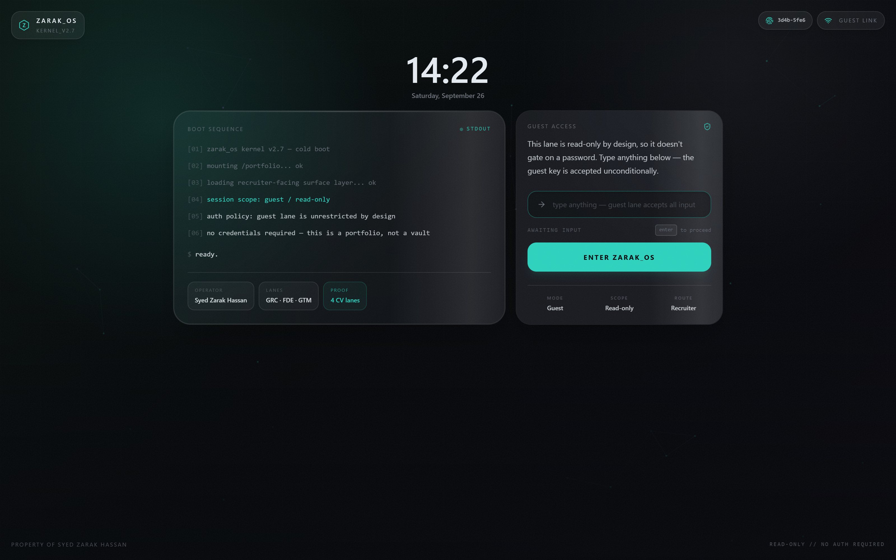

# ZARAK_OS // KERNEL_V2.7

ZARAK_OS is a high-fidelity cyber-noir portfolio operating system for **Syed Zarak Hassan**. It combines a custom desktop shell, recruiter-facing portfolio apps, a deterministic local assistant, and a full 3D MacBook scene to present experience, projects, and security/GRC work as a product surface rather than a static website.



## Overview

The project is split between two presentation layers:

- **3D environment**: an immersive 3D MacBook model built with Three.js / React Three Fiber — animated GIF hinge sticker (Nyan Cat), backlit keyboard with custom canvas-painted icon row, and a projected OS shell screen.
- **OS shell**: the flat desktop UI rendered on top, including windows, dock, Spotlight, Mission Control, Aegis-M, and desktop backdrop controls.

The result is a portfolio that behaves more like a small operating system than a brochure site.

## Current Features

- **3D MacBook scene**: custom Three.js model with a backlit keyboard (14-key fn row, per-key emissive glow), hinge brand strip, animated Nyan Cat GIF sticker, and a screen that projects the live OS shell.
- **Custom OS shell**: draggable, minimizable, resizable, stackable windows with dock, menu bar, Spotlight, and Mission Control flows.
- **Terminal-first identity**: a functional `terminal.app` with portfolio-specific commands, shell-style presentation, and a handful of hidden commands for the curious (`help` leaves a hint).
- **Syed-LLM (`syed-llm.app`)**: local, source-limited portfolio assistant with no API or backend, rendered as a terminal-query interface rather than a chat widget. Answers are grounded in real portfolio/project data with typewriter streaming, sources, and action shortcuts, and free-text Spotlight queries deep-link straight into it.
- **Aegis-M ambient companion**: a shell-local desktop buddy with hover/click lines, passive thoughts, reduced-motion support, and context-aware recruiter/security/product copy.
- **Backdrop Studio (`backdrop.sys`)**: shell-only background switcher for animated desktop presets, including the restored original shell look. Changes persist locally in the browser and do not touch the 3D scene.
- **Recruiter review apps**: native in-OS `CV.app`, `linkedin-experience.app`, `about.txt`, `contact.ssh`, `skills.app`, and `venderscope.browser`.
- **In-app CV rendering**: PDF.js-powered CV preview with download and open-in-tab fallbacks.
- **Keyboard-first navigation**: `⌘/Ctrl/Alt + K` Spotlight, `F3` / modifier + `ArrowUp` Mission Control, plus minimize/quit shortcuts.
- **Dock and shell motion**: small-surface motion design built with `motion/react`, respecting reduced-motion preferences.
- **Cyber-noir visual system**: dark shell chrome, scanlines, cyan/violet accents, subtle glow, and layered backdrop treatments.
- **Dual experience mode**: full desktop shell inside the 3D MacBook on desktop, and a dedicated touch-first mobile shell on smaller devices.

## Tech Stack

- **Framework**: [React 19](https://react.dev/)
- **Build Tool**: [Vite](https://vitejs.dev/)
- **Language**: [TypeScript](https://www.typescriptlang.org/)
- **Styling**: [Tailwind CSS 4.0](https://tailwindcss.com/)
- **Animations**: [Motion](https://motion.dev/)
- **Icons**: [Lucide React](https://lucide.dev/)
- **Interactivity**: [React Draggable](https://github.com/react-grid-layout/react-draggable)
- **Document Rendering**: [PDF.js](https://mozilla.github.io/pdf.js/)
- **Testing**: [Playwright](https://playwright.dev/)
- **3D Graphics**: [Three.js](https://threejs.org/) + [React Three Fiber](https://docs.pmnd.rs/react-three-fiber) + HTML5 Canvas API
- **GIF Decoding**: [gifuct-js](https://github.com/matt-way/gifuct-js) (manual frame decode for Nyan Cat animation)

## Project Structure

```text
src/
├── assistant/          # Local portfolio assistant engine
│   ├── answerEngine.ts # Query → answer resolver with starter questions
│   ├── search.ts       # Token-scored knowledge search (no API)
│   ├── actions.ts      # Action handlers (open app, copy email)
│   ├── types.ts        # AssistantAnswer, AssistantKnowledgeEntry types
│   └── knowledge.generated.ts  # Auto-generated from content/zarak-brain/
├── components/
│   ├── apps/           # Recruiter-facing apps, terminal, Syed-LLM, backdrop studio
│   ├── shell/          # Dock, menu bar, Spotlight, Mission Control, Aegis-M, shell appearance
│   ├── three/          # 3D scene components (MacBookScene, GroundEnvironment)
│   ├── Desktop.tsx     # Main shell composition
│   ├── LoginScreen.tsx # Secure entry sequence
│   └── Window.tsx      # Draggable window wrapper
├── data/               # Recruiter content, Aegis lines, ambient thoughts
├── os/                 # App registry, command registry, reducer, provider, types
├── constants.ts        # Terminal command output
├── Scene3D.tsx         # Primary 3D orchestration layer
└── App.tsx             # Root 2D OS application logic
content/
└── zarak-brain/        # Markdown knowledge base (frontmatter-driven)
scripts/
└── build-assistant-knowledge.mjs  # Compiles content/ → knowledge.generated.ts
tests/
└── e2e/                # Playwright end-to-end test suite
```

## Key Shell Surfaces

- [`src/components/Desktop.tsx`](src/components/Desktop.tsx): shell composition and background provider mount.
- [`src/components/three/MacBookScene.tsx`](src/components/three/MacBookScene.tsx): 3D MacBook model, keyboard canvas textures, Nyan Cat GIF animation.
- [`src/components/shell/AegisBuddyPrototype.tsx`](src/components/shell/AegisBuddyPrototype.tsx): active Aegis-M implementation.
- [`src/components/apps/AskZarak.tsx`](src/components/apps/AskZarak.tsx): Syed-LLM window UI.
- [`src/components/shell/FloatingAskZarak.tsx`](src/components/shell/FloatingAskZarak.tsx): Syed-LLM launcher orb.
- [`src/components/apps/BackgroundStudio.tsx`](src/components/apps/BackgroundStudio.tsx): backdrop selection app.
- [`src/components/shell/DesktopAppearance.tsx`](src/components/shell/DesktopAppearance.tsx): local shell appearance state and persistence.
- [`src/components/shell/DesktopBackgroundLayer.tsx`](src/components/shell/DesktopBackgroundLayer.tsx): animated shell-only background renderer.
- [`src/components/shell/MobileShell.tsx`](src/components/shell/MobileShell.tsx): dedicated touch-first mobile OS experience.
- [`src/os/appRegistry.tsx`](src/os/appRegistry.tsx): visible app registration and labels.

## Getting Started

### Prerequisites

- [Node.js](https://nodejs.org/) (v18 or higher recommended)
- [npm](https://www.npmjs.com/)

### Installation

1. **Clone the repository**:
   ```bash
   git clone https://github.com/syed-hassan7/zarak-os.git
   cd zarak-os
   ```

2. **Install dependencies**:
   ```bash
   npm install
   ```

3. **Start the development server**:
   ```bash
   npm run dev
   ```
   The Vite dev server is bound to `127.0.0.1` for local-only access.

4. **Open the application**:
   Navigate to `http://localhost:3000` in your browser.

### Building for Production

```bash
npm run build
```
Output goes to `dist/`.

## Validation

```bash
npm run lint
npm run build
```

`npm run build` also regenerates the assistant knowledge bundle from `content/zarak-brain/`.

## Testing

```bash
npm run test:e2e
```

Serial run (lower resource usage):
```bash
npm run test:e2e -- --workers=1
```

## Notes

- `syed-llm.app` is the visible product name; the internal app id remains `ask-zarak` to avoid unnecessary shell-state churn.
- Desktop backdrop changes are scoped to the flat shell layer and do not modify the 3D scene, lighting, or projection surfaces.
- 3D framing and screen projection are coupled in `Scene3D.tsx`; camera changes must keep the final MacBook screen overlay alignment intact.
- Aegis-M is a shell companion only — it does not launch apps or replace the Syed-LLM assistant flow.
- MacBook keyboard canvas textures use `generateMipmaps=false` + `LinearFilter` to prevent blur at the steep (~53°) camera viewing angle.

## License

This project is the professional portfolio of Syed Zarak Hassan. All rights reserved.

---
**// END_OF_TRANSMISSION //**
